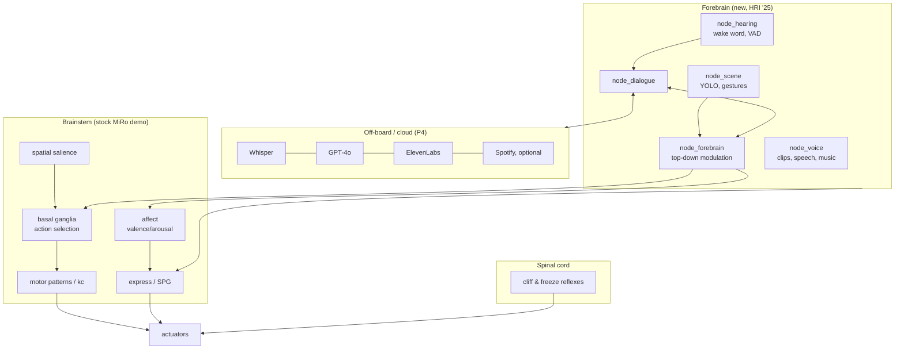

# Hey MiRo! — an extended cognitive architecture for MiRo-e

This repository holds the code for **"Hey Miro! Multimodal Interaction with an Animal-like Robot Companion with
Conversational Abilities"** (Htet, Bernacka, Marei, Holden & Prescott, HRI '25). It extends the layered,
brain-inspired control system of the MiRo-e robot (Mitchinson & Prescott, 2016) with new **forebrain**
components:

- **Spoken conversation:** wake word → voice activity detection → Whisper → GPT-4o → ElevenLabs.
- **Scene awareness:** YOLO object detection and mediapipe hand gestures.
- **Behaviours triggered by speech:** spinning, an impression, dancing to music, tricks, and an object game.

Every behaviour competes through MiRo's basal-ganglia action selection and modulates its affect.

There are two versions of the demo:

| Folder | Runs against | Notes |
|---|---|---|
| [`src/cloud_demo_robot`](src/cloud_demo_robot) | a physical MiRo-e | MiRo's own microphones, or an external/host microphone (`--ext-mic`) |
| [`src/cloud_demo_sim`](src/cloud_demo_sim) | the MiRo Gazebo simulator | the simulator has no sound, so a host **microphone bridge** publishes your laptop's microphone on a new topic `/miro/host/mics`, and MiRo speaks through your laptop speaker |

The two folders contain the same code. Only their settings (`config/heymiro.yaml`), launcher and README differ.
CI checks that they stay in sync.

The Docker image is only the **environment** (ROS Noetic, MiRo MDK, Gazebo, Python packages). The code is
**bind-mounted** from this repository when the container starts. Changes therefore come from git: there is no
`docker commit`, and no code or keys live inside the image.



Details: [docs/architecture.md](docs/architecture.md).

## Repository layout

```
README.md                  this file
config/secrets.env.example template for your API keys and routes (copy it OUTSIDE the repo)
docker/                    Dockerfile + run/build scripts for the environment image
docs/                      architecture, configuration, simulation, security
src/cloud_demo_robot/      the demo for the physical robot   (bind-mounted into the container)
src/cloud_demo_sim/        the demo for the Gazebo simulator (bind-mounted into the container)
tools/check_copies.py      keeps the two project copies in sync
.github/workflows/         image build (GHCR) and CI (tests, secret scan)
```

Inside each project:

```
run_robot.sh / run_sim.sh  start everything
core/                      MDK-style demo code: client_demo.py, node_*.py, action/action_*.py,
                           plus forebrain/ (hearing, dialogue), cloud/ (P4 clients) and choreography/ (dancing)
config/                    heymiro.yaml (settings), persona.md (LLM persona), clips.yaml, songs.yaml
assets/                    voice clips, songs, wake words, gesture model
tools/                     host_audio_bridge.py, mic_check.py, make_clip.py, estimate_bpm.py
tests/                     unit tests (no ROS needed)
```

## Install Docker and get the code

1. Install Docker on your Ubuntu machine: https://docs.docker.com/engine/install/ubuntu/
2. Optional: run Docker without sudo: https://docs.docker.com/engine/install/linux-postinstall/
3. Optional, if your machine has an NVIDIA GPU (YOLO runs faster on it): install the NVIDIA driver and the
   [NVIDIA Container Toolkit](https://docs.nvidia.com/datacenter/cloud-native/container-toolkit/latest/install-guide.html).
   Without them everything still runs on the CPU.
4. Install [Visual Studio Code](https://code.visualstudio.com/) and the **Dev Containers** extension. I use it to
   write and debug code inside the container.
5. Clone this repository:

   ```bash
   git clone https://github.com/HeyMiro/Ext_Cog_Arch.git
   cd Ext_Cog_Arch
   ```

6. Get the environment image. CI builds it from [`docker/Dockerfile`](docker/Dockerfile):

   ```bash
   docker pull ghcr.io/heymiro/ext_cog_arch:latest
   ```

   If the package is private, log in first with a GitHub token that has `read:packages`:
   `echo <token> | docker login ghcr.io -u <github-user> --password-stdin`.
   Or build it yourself with `docker/build_image.bash`; see [docs/docker.md](docs/docker.md).

## Secrets and API routes

API keys and API **routes** (the base URL of each cloud service) are never stored in this repository or in the
image. They live in one file in your home directory:

```bash
install -D -m 600 config/secrets.env.example ~/.config/heymiro/secrets.env
nano ~/.config/heymiro/secrets.env     # fill in your keys
```

`docker/run_docker.bash` mounts this file **read-only** at `/run/secrets/heymiro.env` inside the container, and
`core/heymiro_config.py` reads it.

| Variable | Used for | Default route |
|---|---|---|
| `OPENAI_API_KEY`, `OPENAI_BASE_URL` | Whisper speech-to-text and GPT chat | `https://api.openai.com/v1` |
| `HEYMIRO_LLM_BASE_URL`, `HEYMIRO_LLM_API_KEY` | optional separate route for chat only | falls back to `OPENAI_*` |
| `HEYMIRO_STT_BASE_URL`, `HEYMIRO_STT_API_KEY` | optional separate route for transcription only | falls back to `OPENAI_*` |
| `ELEVENLABS_API_KEY`, `ELEVENLABS_BASE_URL` | text-to-speech (MiRo's voice) | `https://api.elevenlabs.io` |
| `PICOVOICE_ACCESS_KEY` (+ optional `_HEY_MIRO`, `_DANCE_MIRO`, `_STOP_MIRO`) | wake words (Porcupine) and voice activity detection (Cobra) | — |
| `SPOTIFY_CLIENT_ID`, `SPOTIFY_CLIENT_SECRET`, `SPOTIFY_API_BASE_URL`, `SPOTIFY_TOKEN_URL` | optional song lookup | Spotify Web API |

Where a value comes from, highest priority first:

1. environment variables
2. the file named by `HEYMIRO_SECRETS_FILE` (set by `run_docker.bash`)
3. `~/.config/heymiro/secrets.env`

An empty value counts as unset.

**Changing a route** means editing one line and restarting the demo; no code changes are needed. Some examples:

```bash
# a local OpenAI-compatible LLM server (e.g. vLLM or Ollama), keeping OpenAI for Whisper
HEYMIRO_LLM_BASE_URL=http://192.168.0.10:11434/v1
HEYMIRO_LLM_API_KEY=none
# Azure OpenAI (v1-compatible endpoint)
OPENAI_BASE_URL=https://<resource>.openai.azure.com/openai/v1
```

Model names, voice ids and the persona are not secret. They live in `config/heymiro.yaml` and `config/persona.md`.

**When a key is missing, that feature switches off with a one-line warning:**

| Missing key | What happens |
|---|---|
| No OpenAI key | A wake word gives an attention reaction and a clip instead of a conversation. |
| No ElevenLabs key | Replies are printed and a pre-recorded clip is played. |
| No Picovoice key | Use the command topic instead: `rostopic pub -1 /miro/core/forebrain/command std_msgs/String "data: 'dance'"`. |

The `.ppn` wake-word files in `assets/wakewords/` only work with the Picovoice account that trained them. Train
your own "Hey MiRo" at https://console.picovoice.ai if you use a different account.

> **Security note.** The keys that were hardcoded in the old demo code (and therefore inside the public
> `aung9htet/ros_miro:public` image) must be treated as leaked and **rotated**. See [docs/security.md](docs/security.md).
> CI runs a secret scanner on every push.

## Running the Docker container

```bash
# physical robot: find MiRo's IP address in the MiRo app
./docker/run_docker.bash --robot-ip 192.168.0.42

# Gazebo simulator
./docker/run_docker.bash --sim
```

`run_docker.bash` does the following:

- Finds the repository by itself, so there is no path to edit.
- Mounts `src/cloud_demo_robot` and `src/cloud_demo_sim` at `/root/mdk/catkin_ws/src/`.
- Mounts the secrets file read-only.
- Passes through your display (for Gazebo), PulseAudio (for the microphone and speaker) and, if available, the GPU.
- Sets up ROS networking for the chosen mode. It sets `ROS_MASTER_URI` to the robot and detects your own `ROS_IP`,
  so there is no need to edit `~/mdk/share/config/setup.bash` any more.

Run the same command again to open **another terminal** in the running container. To work in VS Code, use
*Dev Containers: Attach to Running Container…* and pick `heymiro`.

Edit the code on the host or in the container; both see the same files. Commit and push from the host as usual.
The container is started with `--rm`: anything you install inside it is lost when it stops. To add a dependency,
change `docker/requirements.txt` or `docker/Dockerfile` in a pull request, and CI rebuilds the image. This
replaces the old `save_docker.bash`.

Other options:

- `--gpu off`: don't pass the GPU through.
- `--image heymiro-env:local`: use an image you built yourself.
- `--no-x11`: run without a display.
- `--secrets FILE`: use a different secrets file.

See `--help` for the full list.

## Running the MiRo demo

### On the physical robot

1. Turn the MiRo on and connect it to the same network as your computer. Find its IP address in the MiRo app.
2. **Turn OFF demo mode in the MiRo app.** Otherwise the robot's own demo and this one fight over the motors.
3. Start the container with `./docker/run_docker.bash --robot-ip <IP>`, then:

   ```bash
   cd ~/mdk/catkin_ws/src/cloud_demo_robot
   ./run_robot.sh              # MiRo's own microphones (quiet rooms)
   ./run_robot.sh --ext-mic    # this computer's / an external microphone (noisy rooms)
   ```

`run_robot.sh` starts the same processes the MiRo runs on board: the camera clients (`- caml`, `- camr`), the
sound localisation client (`- mics`), the new scene client (`- scene`) and the main client. Logs go to
`~/.ros/heymiro/<date>/`. Press Ctrl-C to stop everything.

Say **"Hey MiRo"**. MiRo turns towards you (if you hold up an AprilTag), leans in and listens. It replies, and
keeps listening until nobody has spoken for about 3 s. Ask it to spin, move its ears, do an impression, dance
("can you dance to Dancing Queen?"), "do some tricks" (show it hand signs), or "guess what this is" (show it an
object). Say **"Dance MiRo"** to dance straight away, and **"Stop MiRo"** to stop.

Speech plays on this computer's speaker by default. Put a Bluetooth speaker next to MiRo, as in the HRI '25 demo,
or set `voice.backend: miro` in `config/heymiro.yaml` to use MiRo's own speaker.

### In the Gazebo simulator

```bash
./docker/run_docker.bash --sim
cd ~/mdk/catkin_ws/src/cloud_demo_sim
./run_sim.sh
```

`run_sim.sh` does the following:

1. Starts `roscore` and the MDK Gazebo simulator.
2. Starts `tools/host_audio_bridge.py`. This publishes your microphone on **`/miro/host/mics`**, in exactly the
   format of MiRo's own `/miro/sensors/mics` (4 channels × 500 samples at 20 kHz). It also plays
   `/miro/control/stream` on your speaker.
3. Starts the demo clients.

Talk to the simulated MiRo through your laptop microphone. Wearing headphones avoids MiRo hearing itself. See
[docs/simulation.md](docs/simulation.md).

### Without any keys

```bash
rostopic pub -1 /miro/core/forebrain/command std_msgs/String "data: 'dance abba'"
rostopic pub -1 /miro/core/forebrain/command std_msgs/String "data: 'stop'"
```

Dancing to the bundled songs, tricks, touch reactions and the stock MiRo behaviours all work without any cloud
keys.

## Configuration

All settings are in `config/heymiro.yaml`, with comments; every key is described in
[docs/configuration.md](docs/configuration.md). Put personal tweaks in `config/heymiro.local.yaml`, which git
ignores. The robot and sim copies differ only in this file.

## Troubleshooting

- **No sound or microphone in the container.**
  - Run `pactl info` inside the container, and `python3 tools/mic_check.py --list`.
  - The host needs PulseAudio or PipeWire-pulse.
  - `run_docker.bash` mounts `$XDG_RUNTIME_DIR/pulse/native`.
- **Topics are visible but MiRo ignores commands.** `ROS_IP` is wrong. Start the container with
  `--host-ip <your IP>`.
- **The wake word never triggers.**
  - The `.ppn` files and the Picovoice key must come from the same account.
  - Check the levels with `python3 tools/mic_check.py --topic sensors/mics`.
- **Gazebo is slow without a GPU.** Install the NVIDIA toolkit, or set `LIBGL_ALWAYS_SOFTWARE=1` and be patient.
- **Spotify returns 403.** Spotify closed its audio-analysis API to new apps. Tempos for the bundled songs are in
  `config/songs.yaml`, and Spotify is off by default.
- **Files created in the container are owned by root.** Run `sudo chown -R $USER src/` on the host.

## Development

- Code style follows the MiRo MDK: tabs, `node_*.py` nodes with `tick()`, and actions with
  `compute_priority/start/service/stop`. See the project README for how to add actions and nodes.
- Tests run without ROS:

  ```bash
  cd src/cloud_demo_robot && python3 -m unittest discover -s tests
  ```

- After changing shared code, copy it to the other project with `python3 tools/check_copies.py --fix-from robot`.
  CI fails if the copies differ.

## Citation

```bibtex
@inproceedings{htet2025heymiro,
  title     = {Hey Miro! Multimodal Interaction with an Animal-like Robot Companion with Conversational Abilities},
  author    = {Htet, Aung and Bernacka, Kinga and Marei, Omar and Holden, Jake N. and Prescott, Tony J.},
  booktitle = {Proceedings of the 2025 20th ACM/IEEE International Conference on Human-Robot Interaction (HRI)},
  pages     = {1779--1781},
  year      = {2025},
  doi       = {10.1109/HRI61500.2025.10973974}
}
@inproceedings{mitchinson2016miro,
  title     = {MIRO: A Robot ``Mammal'' with a Biomimetic Brain-Based Control System},
  author    = {Mitchinson, Ben and Prescott, Tony J.},
  booktitle = {Biomimetic and Biohybrid Systems (Living Machines 2016)},
  series    = {Lecture Notes in Computer Science},
  volume    = {9793},
  pages     = {179--191},
  year      = {2016},
  publisher = {Springer},
  doi       = {10.1007/978-3-319-42417-0_17}
}
```

## Licence and credits

- The demo code in `core/` is derived from the MiRo MDK demo by Consequential Robotics. Those files keep their
  original licence headers, and the MDK itself is installed into the image rather than stored here.
- The voice clips were generated with ElevenLabs for this project.
- The bundled songs belong to their respective rights holders and are included for research demonstrations only.
